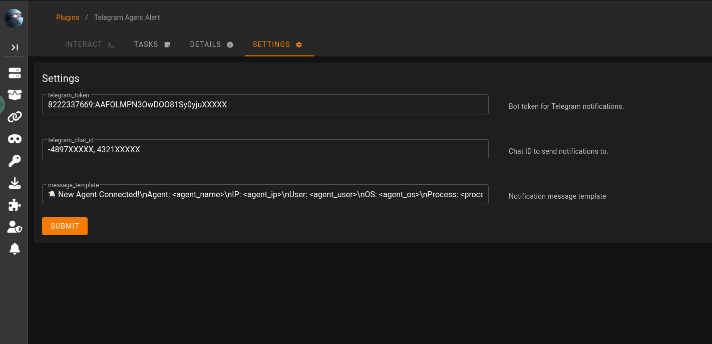

# 🔔 Starkiller Telegram Notifier Plugin

A lightweight **Starkiller** (PowerShell Empire GUI) plugin that sends **real-time Telegram notifications** whenever a new agent connects.  
Stay instantly informed about agent activity — no need to keep Starkiller open.

---

## 🚀 Overview

This plugin integrates seamlessly with **Starkiller** or **PS-Empire**, automatically detecting new agent connections and sending a formatted Telegram message to your chosen chats or groups.  
Perfect for red team operators, SOC analysts, or anyone who wants instant visibility of new connections.


---

## ✨ Features

- 📱 **Instant Telegram alerts** for new agent connections  
- ⚙️ **Customizable message templates** (agent name, IP, hostname, platform, timestamp, etc.)  
- 🔒 **Supports multiple chat IDs** (personal or group)  
- ⚡ **Lightweight and efficient** — minimal dependencies  
---

## 📦 Installation

**Clone or copy** the plugin into your Starkiller `plugins/` directory:

---
   ```bash
   sudo git clone https://github.com/suprsu0x3/TAN-Plugin.git /usr/share/powershell-empire/empire/server/plugins/TAN-Plugin
   ```

